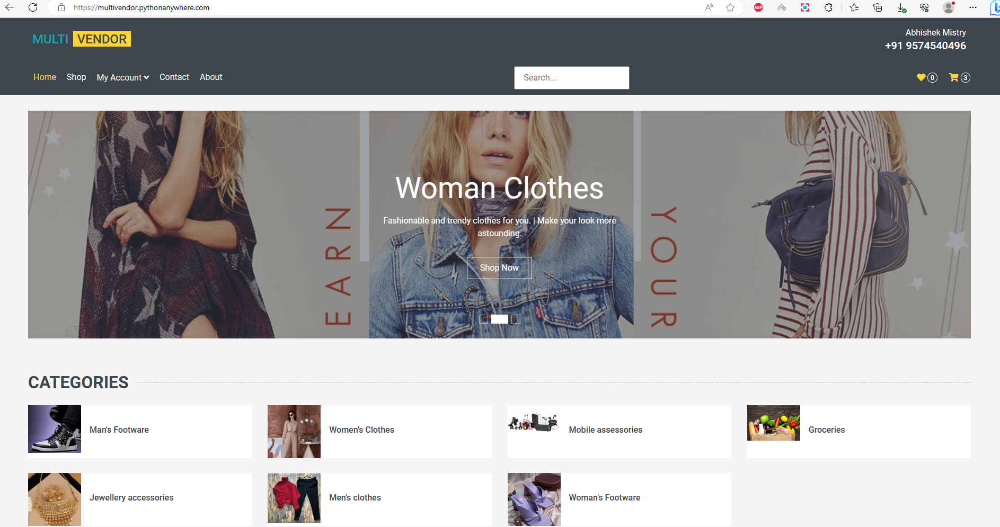
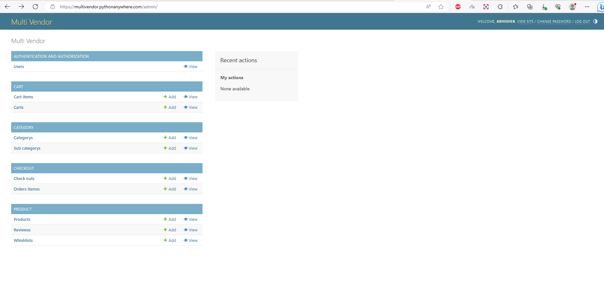

# MultiVendor Django Project By Abhishek Mistry  
##Functionalities:  
  
Admin/Customer Login/Register,Category,Sub Category,Product,Order Placing/Tracking,  
cart,Payment,Invoice,Review,Whishlist,AboutUs,ContactUs  
  
  
##Client Interface:  
  
  
  
##Admin Interface:  
  
Steps:  
-Click on Login then Use this credentials  
+Admin Username:admin  
+Admin password:test@123  
Note:This admin account is intended solely for testing purposes. 
It does not have complete access privileges but rather limited access, allowing only viewing and adding functionality. 
It does not have permission to modify or delete any content because such actions could potentially disrupt the functionality of the hosted website.

